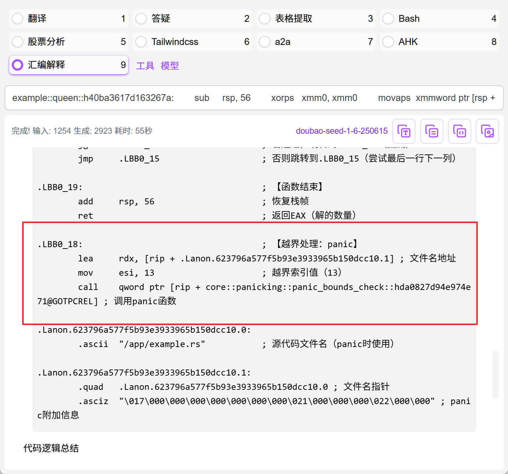

# 源起


起源是看到了[这篇文章](https://www.zhihu.com/question/374708583/answer/1093154743)， @韦易笑 大佬得出的结论是 *rust 真的比 C/C++ 慢 10%-20%*，主要的原因是*rust的数组边界检查*，文章是2020年的，因为这几年Rust 编译器在这块的优化不少，边界检查的开销已经大大降低，所以正好可以用这个问题来验证一下。

在 rust 1.42 中，共有 5 出的边界检查，这基本符合大佬对边界检查的分析。


然后在 Rust 1.88 中，边界检查的开销已经大大降低，只有 1 处边界检查。



以上汇编都是 `-O -C opt-level=3`生成，完整的代码的注释分析可以在 [queen2025/results/rust1.42.md](rust1.42.md) 和 [queen2025/results/rust1.88.md](rust1.88.md) 中查看。

用当下比较新的版本进行测试，环境信息如下

- **操作系统**: Linux Ubuntu 24.04
- **CPU**: Intel(R) Core(TM) i7-13700K
- **内存**: 64 GB
- **Clang 版本**: 18.1.3
- **Rust 版本**: 1.88.0
- **Go 版本**: 1.24.4

以下是运行的结果 `queen/bench.sh` 的输出：

| 语言  | 是否递归  | N  | 时间(ms) |  与C基准实现的耗时对比   |    与C相同算法的耗时对比       | 编码者  |
|------|----------|----|----------|-----------------------|-----------------------------|--------|
| C    | yes      | 13 | 400      | 100.0%                | 100.0%                      | Human  |
| C    | no       | 13 | 423      | 105.8%                | 100.0%                      | Human  |
| Rust | yes      | 13 | 322      | 80.5%                 | 80.5%                       | Human  |
| Rust | no       | 13 | 416      | 104.0%                | 98.3%                       | Human  |
| Go   | no       | 13 | 420      | 105.0%                | 99.3%                       | Human  |

可以看到， Rust 1.88 的运行甚至比 C实现的版本还要快。
另外，Go 的编译器这些年来也是进步不少，Go 1.24 的运行速度也非常接近 C 实现。大佬没有贴出 Go 的运行时间，那时候大概是 Go 1.14 或者更早的版本，跑出的结果应该是会比C慢不少。


# 接力

在查看代码时，能够明显感觉大佬是 C 专家，因为在 Rust/Go 的实现中，基本也是 C 风格，这可能在某些方面会影响到 Rust/Go 的性能。另外，实现本身可能也是随手写的，没有经过优化，到了 2025年，正好让大模型来实现优化看看。

模型是在 Github Copilot 中的 GPT-4.1，提示词是

```
请实现一个 N 皇后问题的求解器，只需输出解的个数即可，分别使用递归和非递归的方式，尽可能优化性能，遵循相应语言的最佳实践。
```

模型编写的代码在 [queen2025] 目录中，每个语言的代码在其对应的子目录中。
从其实现的逻辑来讲，主要通过位运算来优化性能，这在 N 皇后问题中是一个常见的优化手段。

以下是模型实现的结果：

| 语言 | 是否递归 | N  | 时间(ms) | 与C基准实现的耗时对比 | 与C相同算法的耗时对比 | 编码者 |
|------|----------|----|----------|-----------------------|-----------------------------|--------|
| C    | yes      | 13 | 400      | 100.0%                | 100.0%                      | Human  |
| C    | no       | 13 | 423      | 105.8%                | 100.0%                      | Human  |
| Rust | yes      | 13 | 322      | 80.5%                 | 80.5%                       | Human  |
| Rust | no       | 13 | 416      | 104.0%                | 98.3%                       | Human  |
| Go   | no       | 13 | 420      | 105.0%                | 99.3%                       | Human  |
| C    | yes      | 13 | 23       | 100.0%                | 100.0%                      | AI     |
| C    | no       | 13 | 23       | 100.0%                | 100.0%                      | AI     |
| Rust | yes      | 13 | 23       | 100.0%                | 100.0%                      | AI     |
| Rust | no       | 13 | 23       | 100.0%                | 100.0%                      | AI     |
| Go   | yes      | 13 | 23       | 100.0%                | 100.0%                      | AI     |
| Go   | no       | 13 | 23       | 100.0%                | 100.0%                      | AI     |
| C    | yes      | 16 | 5363     | 100.0%                | 100.0%                      | AI     |
| C    | no       | 16 | 5538     | 103.3%                | 100.0%                      | AI     |
| Rust | yes      | 16 | 5485     | 102.3%                | 102.3%                      | AI     |
| Rust | no       | 16 | 5625     | 104.9%                | 101.6%                      | AI     |
| Go   | yes      | 16 | 5405     | 100.8%                | 100.8%                      | AI     |
| Go   | no       | 16 | 5645     | 105.3%                | 101.9%                      | AI     |
| Rust | yes      | 16 | 5485     | 102.3%                | 102.3%                      | AI     |
| Rust | no       | 16 | 5625     | 104.9%                | 101.6%                      | AI     |
| Go   | yes      | 16 | 5405     | 100.8%                | 100.8%                      | AI     |
| Go   | no       | 16 | 5645     | 105.3%                | 101.9%                      | AI     |


可以看到，模型实现的代码性能相当不错。

同时，也能看到，在 N 比较大时候，C 的性能仍然是最好的，但 Rust 和 Go 跟它的差距已经非常小了，1%~2% 在大多数场景是可以接受的。

有些同学可能会问 Go 的性能怎么会如此的好，实际上，Go 性能的瓶颈主要在内存分配上，在这个场景中，这方面的开销非常小，所以有这个结果也是正常的。

# 总结

1. 到了2025年，在计算密集型的场景中，Rust 和 Go 的性能已经非常接近 C 了。
2. Rust 的边界检查开销已经大大降低，性能提升明显。
3. 模型实现的代码性能相当不错，证明了模型在编写特定优化代码方面的能力，特别是对一些经典算法的优化。
